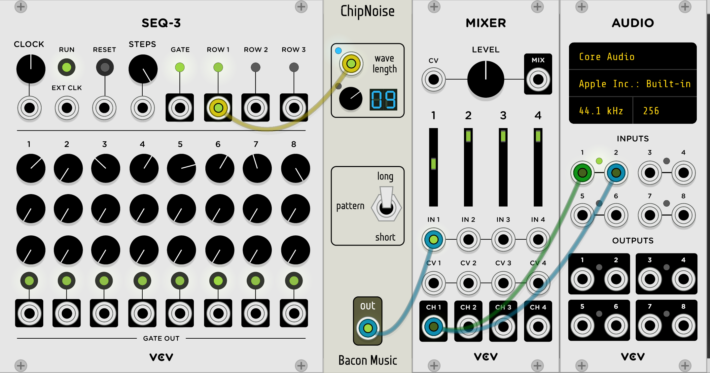

# The Bacon Music VCVRack Modules

"Bacon Music" is my set of EuroRack style plugins for 
[VCVRack](http://www.vcvrack.com). The modules are mostly inspured by me noodling around, and 
they sort of fall into a few groups: 

* Control voltage manipulation on 1v/oct signals to do things like glissando and musical quantization;
* 8-bit-y digital chip-like synthesis, doing things like NES replication and 
various simple noise algorithms;
* and finally, not very useful modulations and  distortions and stuff.

All the source is here, released under an Apache 2.0 license. You are free to use
these modules as you see fit. If you happen to use them to make music you want to share, please
do let me know, either by raising an issue on this github or by tagging me on twitter (@baconpaul) or
soundcloud (@baconpaul).

As of the release of Rack 0.6, these plugins will be built as part of the 
[v2 community distribution](https://github.com/VCVRack/community/tree/v2) so they should just be
available for you to try. A massive thanks to the [Rack community team](https://github.com/VCVRack/community/issues/248)
for maintaining these builds. 

I'm happy to hear any feedback and bug reports. The best way
to reach me is to just open a github issue [right here on github](https://github.com/baconpaul/BaconPlugs/issues). 

Finally, all the [sample patches I used to make the screenshots](https://github.com/baconpaul/BaconPlugs/tree/master/patches) are
on the github here. 

I hope you enjoy the plugins! 

## Control Voltage Manipulation

### HarMoNee

HarMoNee is a plugin which takes a 1v/oct CV signal and outputs two signals,
one which is the original, and the second which is modified by a musical amount,
like a minor 3rd. It spans plus or minus one octave, and is controlled by toggles.

The toggles are additive. So if you want a fourth, choose a major third and a half step 
both. You get the idea. 

### Glissinator

Glissinator takes a control voltage which is undergoing change and smooths out that
change with a linear glissando. It is not triggered by a gate, just by differences
in the input CV. It never jumps discontinously, so if the CV changes "target" value
mid-gliss, the whole thing turns around. The slider will give you between 0 and 1 seconds
of gliss time. Here's a sample patch.

### QuantEyes

QuantEyes takes a CV signal and clamps it to certain values 1/12 of a volt apart.
Functionally this means that CV signals which are changing on input will be clamped to
a chromatic scale on output if all the notes are activated. But you can also deactivate
certain notes to allow you to pick scales to which you quantize.

Since quantizing to scales could be useful for multiple things driving oscillators, 
you can apply this quantization to up to 3 inputs using the same scale.

Finally, you can choose where the "root" note is in CV space. The default is that
1 volt is the "R" note, but if you set root to 3, then 1 3/12 volts would be R. If you don't
understand this, send in a changing signal, select only the R note in the set of LED buttons, 
and then twiddle the root note.

Here's a (pretty cool sounding, I think) patch which combines QuantEyes with the 
Glissinator and Harmonee modules.

## 8-bit-y stuff and chip emulators and the like

### ChipWaves

ChipWaves implements the NES triangle and pulse wave generator. It would have been
impossible to implement without the careful description of the algorithms at
[the NES Dev Wiki](http://wiki.nesdev.com/w/index.php/APU_Triangle).

The NES has two tonal oscilattors, a triangle wave and a pulse. The pulse has 4
different duty cycles. The triangle is a fixed wave. 

They are tuned by wavelength with values up to 2^11 clock cycles. Rather than
expose this very digital interface, though, I've set up the inputs to be tuned
to CV in exactly the same way as VCO-1. So the conversion from 1v/oct signal
to the 2^11 different wavelengths based on the simulated clock frequency (I chose NTSC)
is all done for you.

Basically, it just works like an oscillator. Drop it in and go chip crazy. The sample
patch runs it mixed along with a VCO-1 so I could check tuning. Here's how I did it.

### ChipNoise

ChipNoise implments the NES noise generator without the NES envelope. It would have been
impossible to implement without the careful description of the noise algorithm at
[the NES Dev WIKI](http://wiki.nesdev.com/w/index.php/APU_Noise).

The NES noise system has 16 different frequencies; and two modes. The two modes generate either
a long pseudo-random pattern or (one of two) short pseudo-random patterns.

The module just outputs the noise with a switch to change the mode and a knob to select the
frequency. The knob is also exposed to CV. And yes, it really sounds like an NES. Here's a simple
patch.

## Distortions and Modulations and so on
### ALingADing 

ALingADing is a simulation of a Ring Modulator based on [this paper by Julian Parker](http://recherche.ircam.fr/pub/dafx11/Papers/66_e.pdf) and
then taking some shortcuts.
Rather than following Parker's use of a few polynomials to simulate his diode, 
I basically use an implementaion of a softmax, eyeballing the parameters to roughly meet the figure in his
paper. The only control is a wet/dry mix (where wet is the signal modulated by carrier
and dry is just the signal). Sloppy, sure, but it sounds kinda cool. Here's a sample patch.

### Bitulator

Bitulator is really just me screwing around with some math on the input. It has two
functions. Firstly, it "quantizes" to a smaller number of "bits", but does it in a
wierd and sloppy way of basically making sure there are only N values possible in the 
output. Apply this to a sine wave with a low value of N and you get sort of stacked squares. 
Secondly it has a gross digital clipping amplifier. Basically signal is the clamp of input times
param. Apply this to a sine wave and turn it up and you get pretty much a perfect square.
Combine them for grunky grunk noise. Dumb, but fun. Here's a sample patch.

## Hey, what's with the repo name "BaconPlugs" vs slug "Bacon Music"

So when I made my git repo I had no idea really how anything worked or if I'd write anything. 
I was thinking "Hey I'm writing a collection of plugins for this software right". When I went
with my first release, Andrew Rust pointed out that "BaconPlugs" wasn't a very good name for my 
plugin and it's collected modules. He did it very politely, of course, and so I changed it to "Bacon Music" 
for the slug name. The repo is still called BaconPlugs though, because that's more trouble to change than 
I can handle.

## License

Copyright © 2017-2018  Paul Walker

Licensed under the Apache License, Version 2.0 (the "License");
you may not use this file except in compliance with the License.
You may obtain a copy of the License at

http://www.apache.org/licenses/LICENSE-2.0

Unless required by applicable law or agreed to in writing, software
distributed under the License is distributed on an "AS IS" BASIS,
WITHOUT WARRANTIES OR CONDITIONS OF ANY KIND, either express or implied.
See the License for the specific language governing permissions and
limitations under the License.

