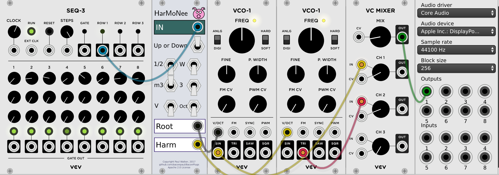

# BaconPlugs

BaconPlugs are my set (currently of size 1) of EuroRack style plugins for 
[VCVRack](http://www.vcvrack.com). The modules are mostly just me noodling around.
All the source is here, releases under an Apache 2.0 license. You are free to use
these modules as you see fit. If you happen to use them to make music, please
do let me know, either here or by tagging me on twitter (@baconpaul).

I build regularly on MacOS and check that it builds on Linux from time to time.

## HarMoNee

HarMoNee is a plugin which takes a 1v/oct CV signal and outputs two signals,
one which is the original, and the second which is modified by a musical amount,
like a minor 3rd. It spans plus or minus one octave, and is controlled by toggles.

The toggles are additive. So if you want a fourth, choose a major third and a half step 
both. You get the idea. Here's the sample patch I use for testing in the current version.

## License

Copyright © 2017  Paul Walker

Licensed under the Apache License, Version 2.0 (the "License");
you may not use this file except in compliance with the License.
You may obtain a copy of the License at

http://www.apache.org/licenses/LICENSE-2.0

Unless required by applicable law or agreed to in writing, software
distributed under the License is distributed on an "AS IS" BASIS,
WITHOUT WARRANTIES OR CONDITIONS OF ANY KIND, either express or implied.
See the License for the specific language governing permissions and
limitations under the License.

