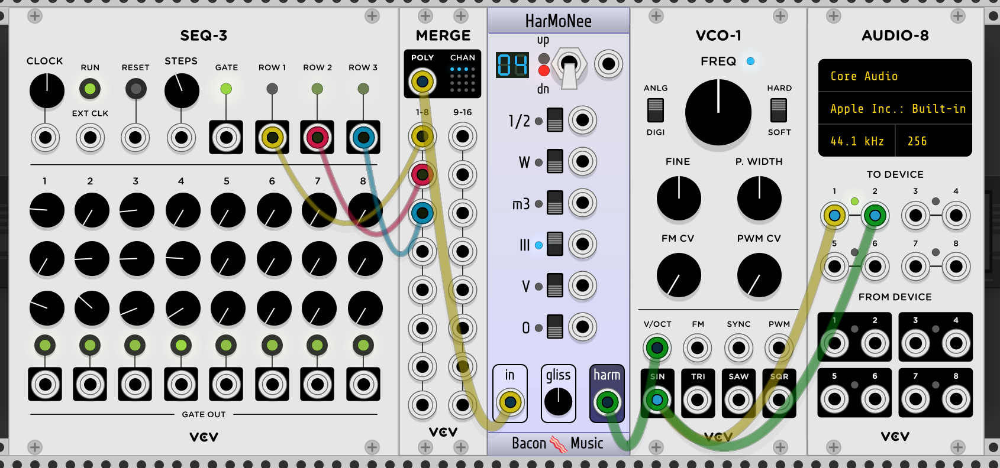
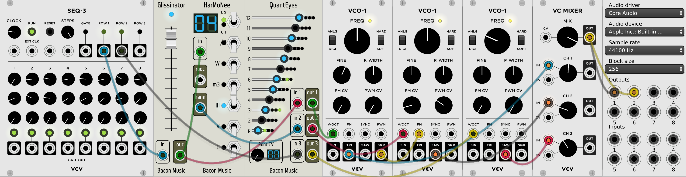
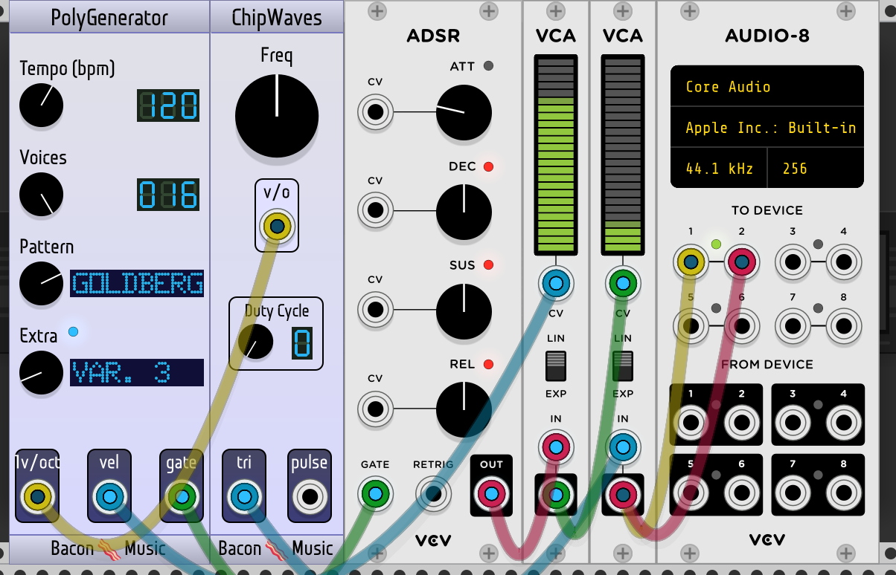
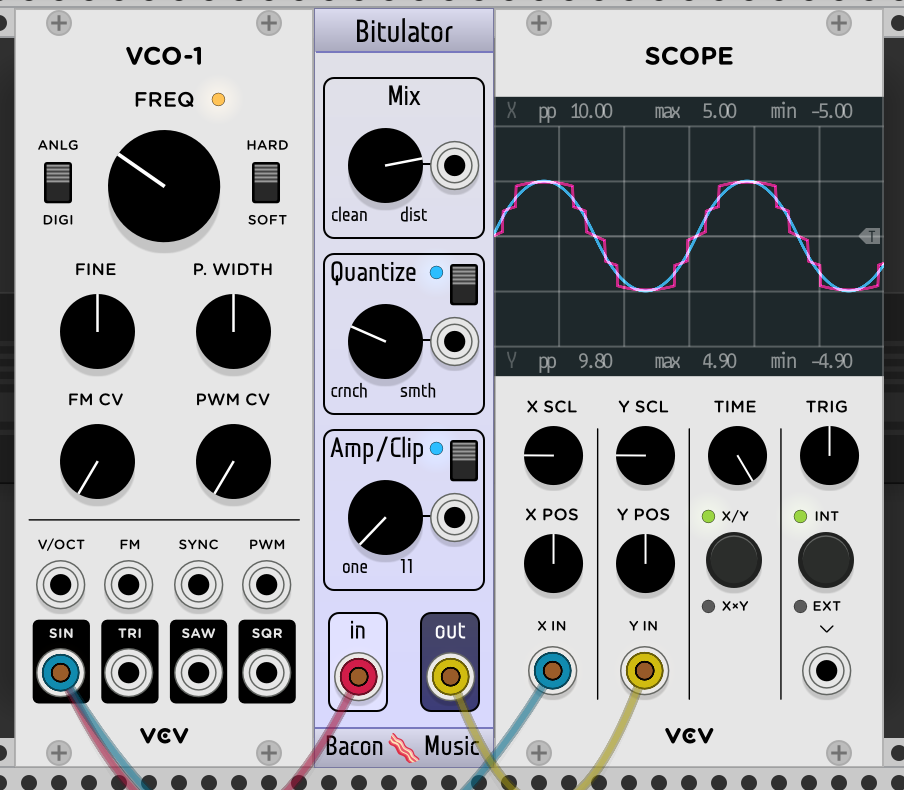

# The Bacon Music VCVRack Modules

"Bacon Music" is my set of EuroRack style plugins for 
[VCVRack](http://www.vcvrack.com). The modules are mostly inspired by me noodling around with the platform
since v0.5.something, and 
they sort of fall into a few groups: 

* Control voltage manipulation on 1v/oct signals to do things like glissando and musical quantization and a polyrhytmic clock;
* Classic synth algorithms, including an implementation of the NES oscillators and a Karplus Strong implementation, as well
  as wrapping [Robin Schmidt's](http://www.rs-met.com) open303 implementation.
* A polyphonic signal generator
* and finally, not very useful modulations and distortions and stuff.

All the source is here, released as of version 1.0.0 under a GPL3 license. (Prior versions were Apache 2). 
You are free to use
these modules as you see fit. If you happen to use them to make music you want to share, please
do let me know, either by raising an issue on this github or by tagging me on twitter (@baconpaul) or
soundcloud (@baconpaul).

I'm happy to hear any feedback and bug reports. The best way
to reach me is to just open a github issue [right here on github](https://github.com/baconpaul/BaconPlugs/issues). 

I hope you enjoy the plugins! 

## Control Voltage Manipulation and Clocks

### HarMoNee

HarMoNee is a plugin which takes a 1v/oct CV signal and outputs that signal
is modified by a musical amount,
like a minor 3rd. It spans plus or minus one octave, and is controlled by toggles.

The toggles are additive. So if you want a fourth, choose a major third and a half step 
both. Each of the toggles has a CV control.

To avoid sudden clicks and
pops when the voltage changes rapidly, HarMoNee also provides a smooth transition between
values at a rate set by the Gliss knob.

The module is polyphonic and will apply the shift to each element of a polyphonic input
with polyphonic width triggered by the 1v/oct input.

### Glissinator

Glissinator takes a control voltage which is undergoing change and smooths out that
change with a linear glissando. It is not triggered by a gate, just by differences
in the input CV. It never jumps discontinuously, so if the CV changes "target" value
mid-gliss, the whole thing turns around. The slider will give you between 0 and 1 seconds
of gliss time. There is a gate output which is +10v when the module is glissing and
0 when it isn't. Note that the Glissinator is a constant time gliss, not a constant
slope gliss (which is what a slew limiter would do). A future version may have a switch
to pick between the modes.

The Glissinator is polyphonic, independently sliding multiple signals, with polyphonic
width triggered by the 1v/oct input.

Here's a sample patch.

### QuantEyes

QuantEyes takes a CV signal and clamps it to certain values 1/12 of a volt apart.
Functionally this means that CV signals which are changing on input will be clamped to
a chromatic scale on output if all the notes are activated. But you can also deactivate
certain notes to allow you to pick scales to which you quantize.

If you would like some scale presets, the right mouse button will set to a few scales.
If you want to add more pre-canned scales it's easy for me to do. Just open a github issue.

Finally, you can choose where the "root" note is in CV space. The default is that
1 volt is the "R" note, but if you set root to 3, then 1 3/12 volts would be R. If you don't
understand this, send in a changing signal, select only the R note in the set of LED buttons, 
and then twiddle the root note.

QuantEyes is polyphonic, applying the clamp independently to each polyphonic channel,
with polyphonic width driven by the input field.

QuantEyes pairs particularly nicely with Glissinator, clamping the gliss to constrained
notes for a keyboard-style step gliss.

### PolyGnome

PolyGnome is a polyrhytmic clock generator. It can output up to 5 clock signals with strict 
fractional relationships between them. There is one clock which is the "1/1". Then there are 4
other clocks which are fractionally adjusted clocks. This way you can do a 1/1 vs a 5/3 vs a 4/5
polyrhythm easily in your rack.

PolyGnome outputs both a gate and a tempo CV level for each clock it has configured.

## Classic and 8-bit algorithms

### ChipWaves

ChipWaves implements the NES triangle and pulse wave generator. It would have been
impossible to implement without the careful description of the algorithms at
[the NES Dev Wiki](http://wiki.nesdev.com/w/index.php/APU_Triangle).

The NES has two tonal oscillators, a triangle wave and a pulse. The pulse has 4
different duty cycles. The triangle is a fixed wave. 

They are tuned by wavelength with values up to 2^11 clock cycles. Rather than
expose this very digital interface, though, I've set up the inputs to be tuned
to CV in exactly the same way as VCO-1. So the conversion from 1v/oct signal
to the 2^11 different wavelengths based on the simulated clock frequency (I chose NTSC)
is all done for you.

Basically, it just works like an oscillator. Drop it in and go chip crazy. 

The oscillator is polyphonic, with polyphony width driven by the 1v/octave inputl

### ChipNoise

ChipNoise implements the NES noise generator without the NES envelope. It would have been
impossible to implement without the careful description of the noise algorithm at
[the NES Dev WIKI](http://wiki.nesdev.com/w/index.php/APU_Noise). I also appreciate the
[lengthy conversation with @alto77](https://github.com/baconpaul/BaconPlugs/issues/6) which helped
identify a bug in the 0.6.1 release and add a new feature.

The NES noise system has 16 different frequencies; and two modes. The two modes generate either
a long pseudo-random pattern or a set of short pseudo-random patterns. That long pattern is just 
long, but the short patterns are either 93 or 31 bits long. There are 351 distinct 93 bit patterns
and a single 31 bit pattern. 

The sequence controls allow you to pick these patterns. If set at "long" then you choose the longest
pattern. If set at short, then either you have the 31 long pattern or one of the 93 patterns. Which of
the 93 patterns you pick is chosen by the "which 93 seq" knob. 

This is a lot of information. If you just play with it you'll get the idea.

### ChipYourWaves

ChipYourWaves is a chip-like oscillator which doesn't actually exist in the old NES hardware.
The way the NES triangle wave generator works is it oscillates across a 32-sample-wide waveform of values
between 0 and 15, with 7/8 being the "zero point". This is set up as a ramp 0 1 2 ... 15 15 14 ... 0 
and then tuned and oscillated. If you want this waveform, just use the ChipWaves module up above.

But I got to thinking. That waveform is something we could change and make even buzzier grunky chip-like 
sounds. Perhaps. So I wrote a module which is the same internal implementation as the NES triangle wave
generator in ChipWaves but which has an editor which lets you pick each of the 32 values. Then you can
hear it. And see if you like it. 

To set the values just click or drag on the LED vertical. It's pretty intuitive when you use it, I think. But
so you get an idea, here's the sample patch which sets a fixed frequency and hooks it up to the scope so you can
see the generated waveform is, indeed, the bits you draw in the LED-like controls.

Oh if you have any idea what to put in all that blank space at the top of the module, by the way, please do
just raise a github issue and let me know!

### KarplusStrongPoly

The [Karplus-Strong algorithm](https://en.m.wikipedia.org/wiki/Karplus–Strong_string_synthesis) is one of the
earlier methods to simulate plucked string instruments. The KarplusStrongPoly module implements a polyphonic
voides implementation of this. The module maps to the algorithm fairly cleanly. It's probably easier that you 
just play with it.

The module is polyphonic, but in an unexpected way. Since the module triggers notes which have independent decay,
the gate signal is polyphonic and the output is; but the output polyphonic signal can have two notes sounding at
once on a channel. If you send two triggers in one poly channel in quick successeion, the internal voice management
will keep both voices alive until they finish.

I've only implemented one filter so far, so the only control which does anything in the filter space is the "A" 
knob and CV input. If/as I add more that will get way more rich, kind of like initial packet is now.

Finally I think the algorithm is stable under all possible front panel configurations. There's certainly
regimes of parameters in the C++ which can break the synthesis, though. So if you get an
odd or growing sound, let me know the configuration which did it in a github issue and I'll put a check
in the widget to synth snap appropriately.

### Open303

Open303 is an implementation of [Robin Schmidt's](http://www.rs-met.com/) open303 library as a rack module. 
It is currently in alpha and this documentation will be completed before I release into the plugin manager.

## Polyphonic Signal Test Generator

I realized, while developing various polyphonic modules, I needed a set of good test inputs. As such, I wrote
PolyGenerator, which has a collection of random/programatic and midi based outputs as polyphonic signals
on a gate (note on/off) velocity (0->10v) and pitch (1v/oct). This allowed me to do tests of big polyphonic 
networks without having to hook up a keyboard and mash keys in my dev cycle.

## Distortions and Modulations and so on
### ALingADing 

ALingADing is a simulation of a Ring Modulator based on [this paper by Julian Parker](http://recherche.ircam.fr/pub/dafx11/Papers/66_e.pdf) and
then taking some shortcuts.
Rather than following Parker's use of a few polynomials to simulate his diode, 
I basically use an implementation of a softmax, eye-balling the parameters to roughly meet the figure in his
paper. The only control is a wet/dry mix (where wet is the signal modulated by carrier
and dry is just the signal). Sloppy, sure, but it sounds kinda cool. Here's a sample patch.

### Bitulator

Bitulator is really just me screwing around with some math on the input. It has two
functions. Firstly, it "quantizes" to a smaller number of "bits", but does it in a
weird and sloppy way of basically making sure there are only N values possible in the 
output. Apply this to a sine wave with a low value of N and you get sort of stacked squares. 
Secondly it has a gross digital clipping amplifier. Basically signal is the clamp of input times
param. Apply this to a sine wave and turn it up and you get pretty much a perfect square.
Combine them for grunky grunk noise. Dumb, but fun. Here's a sample patch. It is polyphonic
on the inputs and outputs as expected.

## Credits and Comments

The Keypunch font used in the textual display LED widget comes from 
[Stewart C. Russell's blog](http://scruss.com/blog/2017/03/21/keypunch029-for-all-your-punched-card-font-needs/). 
The font is Copyright 2017 Stewart C. Russell and is released under 
the [SIL Open Font License 1.1](http://scripts.sil.org/cms/scripts/page.php?site_id=nrsi&id=OFL).

The MIDI file of the goldberg variations in res/midi is from Dave Grossman's J.S. Bach page
at http://www.jsbach.net. The MIDI files of other composers are from Bernd Krueger's piano-midi.de site,
and are released under cc-by-sa Germany License as described http://www.piano-midi.de/copy.htm

The Bacon Emoji is from twitters https://twemoji.twitter.com outstanding free SVG emojis,
which are cc-sa-4.

The open 303 library in libs/open303-code/ is by Robin Schmidt, released under MIT license, and re-used here
with his blessing. Robin's software can be found at http://www.rs-met.com

The slug name ('BaconMusic') is different than the repo name ('BaconPlugs'), somewhat confusingly.
When I made my git repo I had no idea really how anything worked or if I'd write anything. 
I was thinking "Hey I'm writing a collection of plugins for this software right". When I went
with my first release, Andrew Rust pointed out that "BaconPlugs" wasn't a very good name for my 
plugin and it's collected modules. He did it very politely, of course, and so I changed it to "Bacon Music" 
for the slug name. The repo is still called BaconPlugs though, because that's more trouble to change than 
I can handle.

## License

Copyright © 2017-2019  Paul Walker

Licsened under the Gnu Public License, version 3. https://www.gnu.org/licenses/gpl-3.0.en.html

